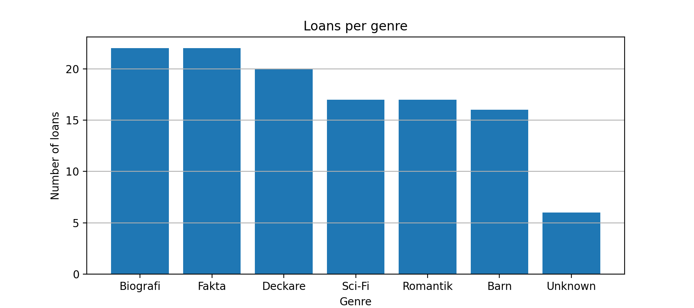
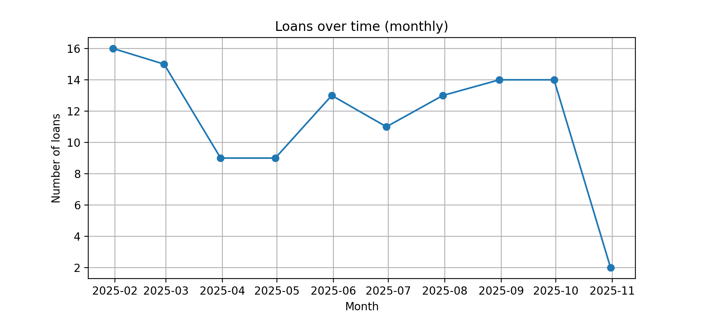
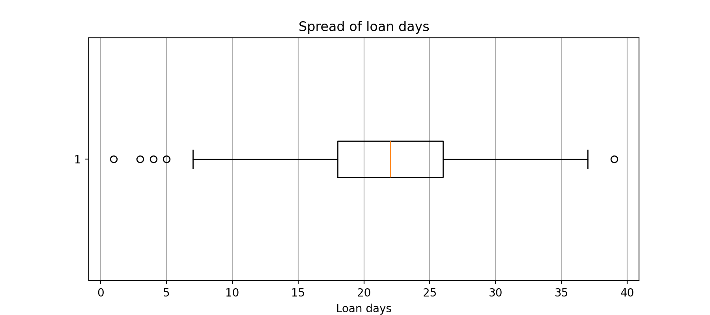
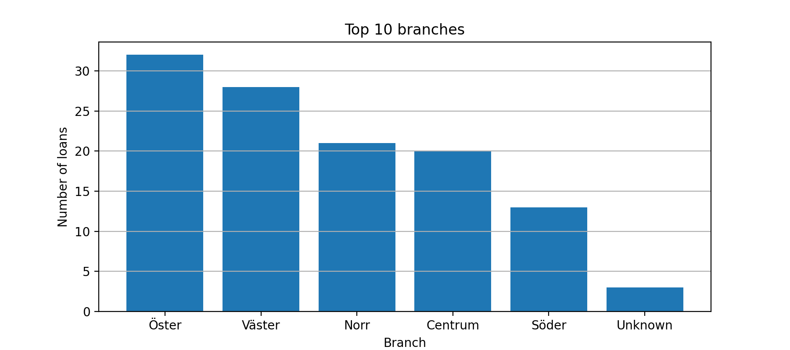

<<<<<<< HEAD

=======
# EDA - Biblioteksutlåning

## Rapport
### Nyckeltal (från notebooken, efter lätt städning)
- **Total loans:** 116
- **Average loan days:** 21.3
- **Overdue rate:** 47.6%

### Figurer





### Tabeller (exporterade)
- `data/pivot_branch_x_genre.csv`

### Slutsatser på aktuell data
- **Top genres:** 1. Biografi (22), 2. Fakta (22), 3. Deckare (20)
- **Top filials:** 1. Öster (32), 2. Väster (28), 3. Norr (21)
- **Monthly top:** 2025-01 med **16** unika lån per månad
- **Policy note:** Övertidsandel ligger på **47.6%** - följ upp med påminnelser


## Miljö
- **Python:** 3.13.5
- **Packages:** `Pandas`, `matplotlib` (se `requirements.txt`)

## Kom igång
```bash
* klona projektet
git clone https://github.com/markusgunnar/EDA_Video_Lektion.git
cd library-eda

# Skapa och aktivera virtuell miljö
python -m venv .venv
# Windows PowerShell
.venv\Scripts\Activate
# macOS/Linux
# source .venv/bin/activate

# installera beroenden
python -m pip install -r requirements.txt

```
>>>>>>> markus_branch
